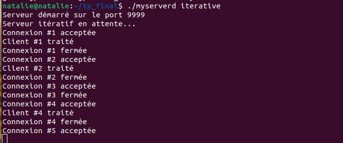
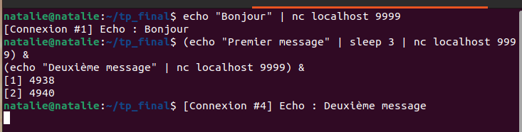
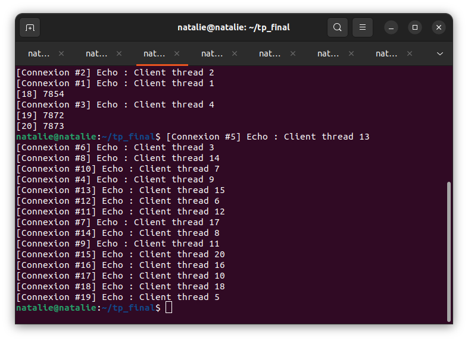
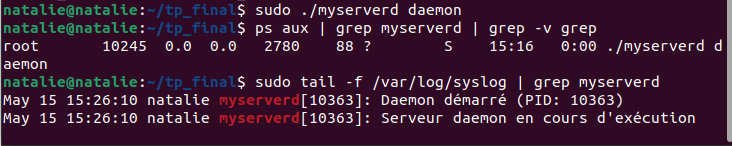

# Rapport d'analyse technique - Serveur UNIX Complet

## Introduction:
Cе prоjet visе à créer еt à mеttre еn placе un servеur de fichiеrs distribué en utilisаnt le langage C sur le systèmе d'eхplоitatiоn Linuх. Dans le cadre dе ma fоrmatiоn en Liсеnсe 3 Systèmеs et Réseаuх, j'ai соnçu un serveur TCP qui ехаminе сinq mоdèles architecturauх distincts.

1. **Serveur itératif** (Partie 1)
2. **Serveur concurrent en utilisant la fonction fork()** (Partie 2)
3. **Serveur concurrent en utilisant les pthreads** (Partie 3)
4. **Serveur multiplexé en utilisant la fonction select()** (Partie 4)
5. **Serveur mode daemon utilisant la fonction syslog()** (Partie 5)

La finalité de l’expérience consistait à comprendre les avant

   ## Partie 1 - Serveur TCP itératif

### Objectif
Écrire un programme servant de serveur TCP minimal qui traite un seul client à la fois.

### Code implémenté
- Socket TCP initialisée par `socket()`
- Paramètre `SO_REUSEADDR` défini pour l'utilisation du même port
- `bind()` sur le port 9999
- `listen()` avec backlog = 10
- Boucle `accept()` -> `read()` -> `write()` -> `close()
### Démo du comportement itératif

**Écran capture 1 :** Serveur itératif en exécution



Deux clients en même temps –

  ### Analyse du comportement

Dans le cas où deux clients se connectent en même temps, le second client **attend** que la prise en charge du premier client soit complètement faite avant de pouvoir être pris en charge, de par la nature séquentielle de la boucle principale.


Connexion #1 acceptée
Client #1 traité (prend 3 secondes)
Connexion #1 fermée
Connexion #2 acceptée
Client #2 traité


*C’est intéressant pourquoi ?**  
Le modèle itératif bloque dans l’appel `read()` pour chaque client. Le serveur ne peut pas retourner à `accept()` pour le prochain client, tant que le premier n’est pas prêt.

---

## Partie 2 - Serveur concurrent avec fork()

### But
Se mettre en mesure de traiter simultanément plusieurs clients en créant un nouveau processus fils pour chaque connexion cliente.


## Architecture implémentée
```c
while(1) {
    connfd = accept(listenfd, ...);
    pid = fork();
    if (pid == 0) {
        close(listenfd);
        handle_client(connfd);
        exit(0);
    }
    close(connfd);
}
```
## Gestion des zombies

Utilisation d’un gestionnaire SIGCHLD avec waitpid(-1, NULL, WNOHANG) pour évacuer les fils zombies.
Compteur partagé des connexions actives


Utilisation de la mémoire partagée POSIX :
```c
int shmid = shmget(IPC_PRIVATE, sizeof(int), IPC_CREAT | 0666);
int *connexions_actives = shmat(shmid, NULL, 0);
```


## Arbre des processus observé
Capture d’écran 3 : arbre des processus via ps aux



## Test avec 8 clients simultanés

Capture d'écran 4 : Test des 8 clients


## Commande utilisée :
```bash

for i in {1..8}; do (echo "client $i" | nc -q 1 localhost 9999) & done
```

## Analyse

  - Traitement simultané de 8 clients

- Chaque fils dispose d’espace mémoire propre

- Mémoire partagée pour que le père suive l’activité

## Partie 3 – version multithreadée par pthreads
### Objectif

Remplacer les processus par des threads pour partager la mémoire de manière plus efficace.

### Implémentation

Passage sécurisé du descripteur :
```c
int *fd_copy = malloc(sizeof(int));
*fd_copy = connfd;
pthread_create(&tid, NULL, handle_client_thread, fd_copy);
pthread_detach(tid);
```
**Pourquoi alors ne pas passer &connfd directement ?**
Car la variable connfd est modifiée à chaque itération. Les threads se battraient donc pour lire la dernière valeur, entraînant des race conditions.

### Mutex pour le compteur global
```cpthread_mutex_t mutex_connexions = PTHREAD_MUTEX_INITIALIZER;

void incrementer_connexions() {
    pthread_mutex_lock(&mutex_connexions);
    connexions_actives++;
    pthread_mutex_unlock(&mutex_connexions);
}
```


### Pool de threads (MAX_THREADS = 16)

Le serveur refuse des nouvelles connexions lorsque le pool est saturé.



## Partie 4 - Multiplexage des Entrées/Sorties avec select()
### But

Implémenter un serveur mono-thread capable de gérer plusieurs clients en parallèle par le biais du multiplexage.

### Implémentation de select()
```c
fd_set readfds;
FD_ZERO(&readfds);
FD_SET(listenfd, &readfds);

while (1) {
    activity = select(maxfd + 1, &readfds, NULL, NULL, &timeout);
    
    if (FD_ISSET(listenfd, &readfds)) {
        // Nouvelle connexion
    }
    
    for (i = 0; i < FD_SETSIZE; i++) {
        if (clients[i] != -1 && FD_ISSET(clients[i], &readfds)) {
            // Lire les données du client
        }
    }
}
```


1. Quelle est la contrainte fondamentale de select() absente dans poll() ?

select() est contraint par FD_SETSIZE (typiquement 1024) qui est une constante d’implémentation, poll() exploite un tableau dynamique sans limite fixée.

2. Pourquoi FD_SETSIZE=1024 peut-il être gênant en phase exploitation ?

    ne permet pas de gérer plus de 1024 connexions simultanées

    impose de recompiler le programme à chaque fois qu’il faut augmenter cette limite ;

    pas extensible pour les serveurs haute charge ;

3. Quand préfère-t-on poll() à select() en cas de 500 connexions ?

poll() est à privilégier car pas de limite arbitraire, autre structure plus simple et meilleur comportement.

4. Dans le cas d’un besoin de 10 000+ connexions (C10K), quelle syscall privilégier ?

epoll() sous Linux, complexité O(1), événements edge-triggered, pas de recopie des tableaux.

## Partie 5 - Daemonisation et gestion des logs
### Objectif

La transformation du serveur en daemon UNIX avec journalisation via syslog .

### Séquence de daemonisation implémentée
```c
void daemonize(const char *pidfile) {
    if ((pid = fork()) > 0) exit(0);
    setsid();
    if ((pid = fork()) > 0) exit(0);
    chdir("/");
    umask(0);
    close(0); close(1); close(2);
    open("/dev/null", O_RDONLY);
    open("/dev/null", O_WRONLY);
    open("/dev/null", O_WRONLY);
    FILE *f = fopen(pidfile, "w");
    fprintf(f, "%d", getpid());
    fclose(f);
}
```
### Configuration syslog




**Ligne ajoutée dans etc/rsyslog.d/myserverd.conf**

### Fichier PID et détection de double instance

Le daemon vérifie au démarrage si un fichier PID existe et si le processus est toujours actif.


## Conclusion
### Synthèse des modèles architecturaux
**itératif**:Simple,Bloquant,Debug
**fork()**:Robuste,Mémoire élevée,Applications, critiques
**Threads**:Rapide, faible mémoire,Synchronisation,Services généralistes
**select()**:Mono-thread,Limité à 1024,Applications modérées
**Daemon**:Tourne en arrière-plan,Difficile à déboguer,Services système


**Auteurs**: RASOANOMENJANAHARY Nathalie & RAKOTONDRAMANANA Miora Caroline Marinah

**Mention** : INFORMATIQUE

**Parcours** : INFORMATIQUE L3

Date : Mai 2026